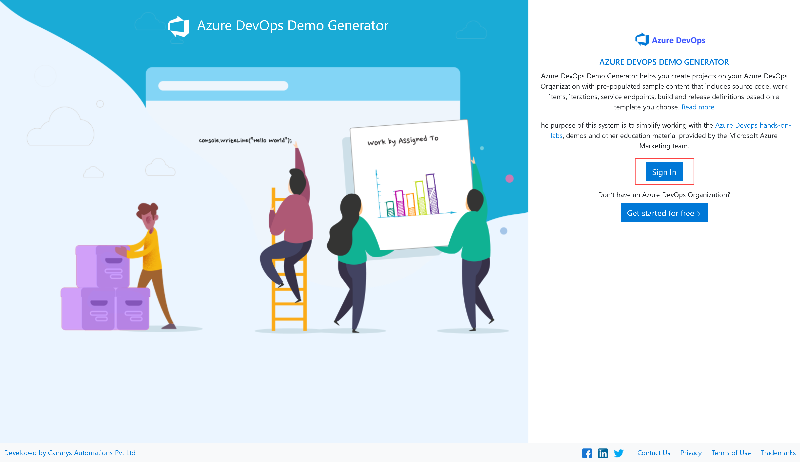
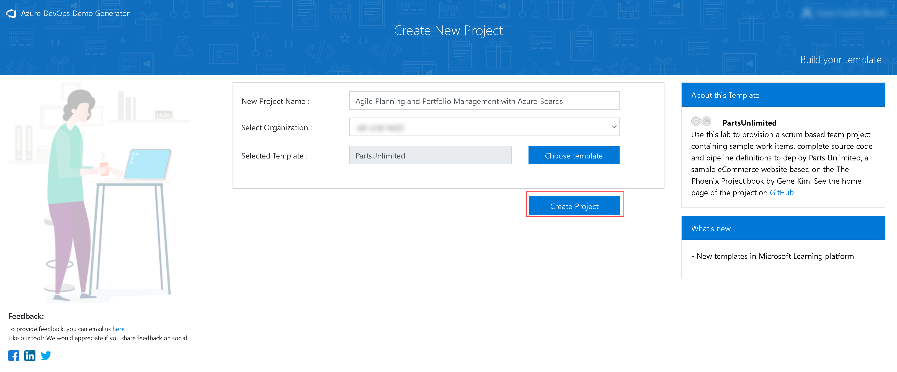
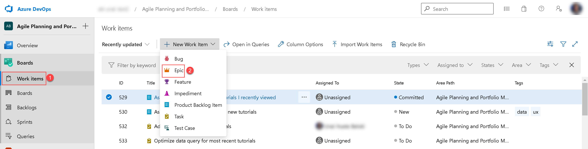
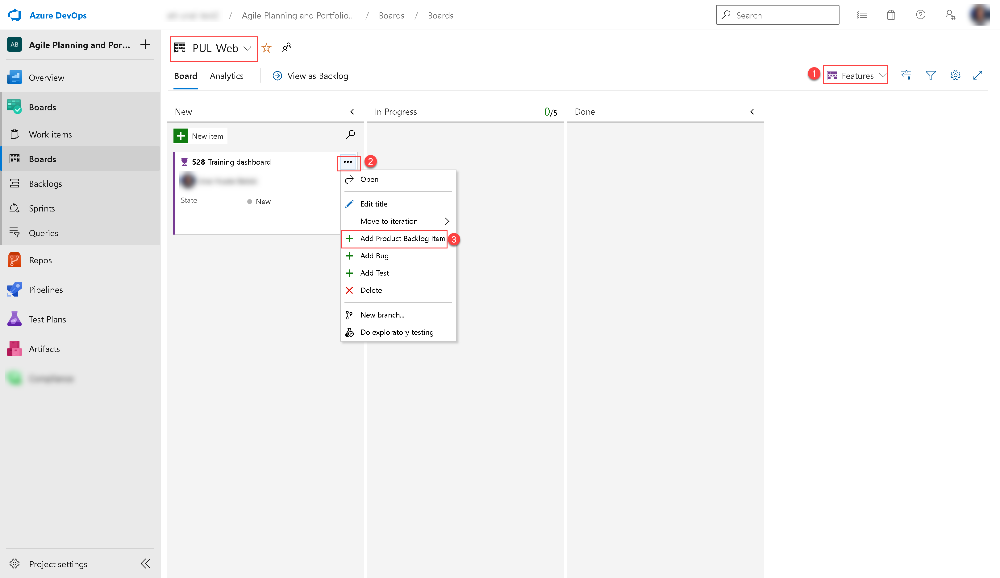
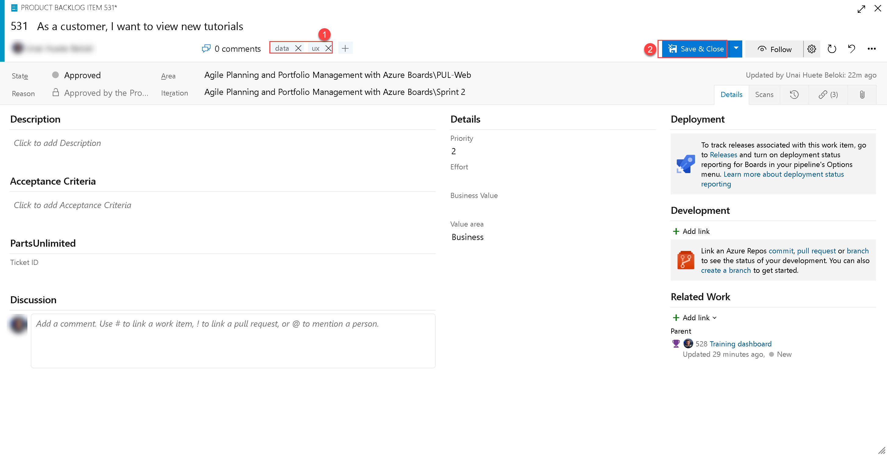
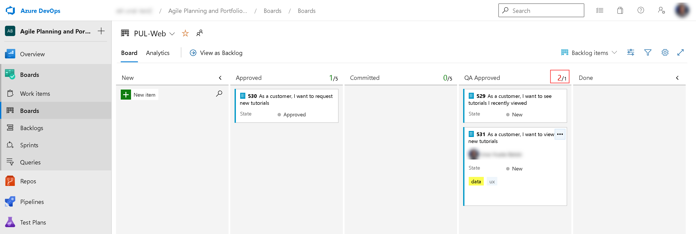
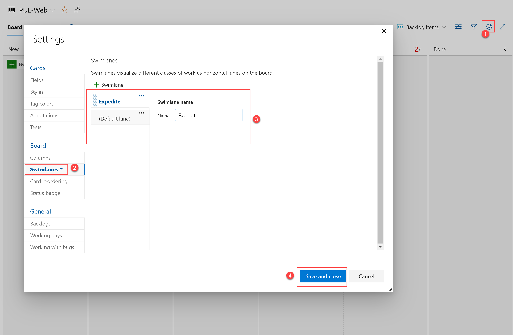
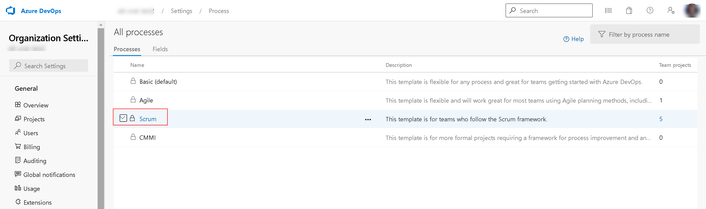
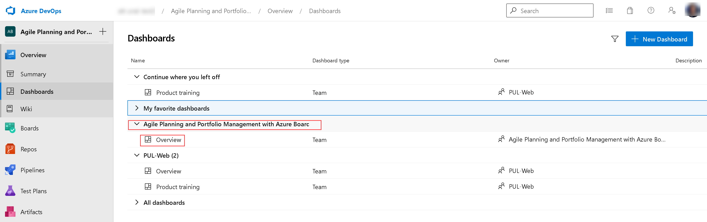

---
lab:
    title: 'ラボ 01: Azure Boards を使用したアジャイル プランニングとポートフォリオ管理'
    module: 'モジュール 1: DevOps の計画'
---

# ラボ 01: Azure Boards を使用したアジャイル プランニングとポートフォリオ管理
# 受講生用ラボ マニュアル

## ラボの概要

このラボでは、Azure Boards が提供するアジャイル プランニングとポートフォリオ管理のツールとプロセス、およびチーム全体で作業をすばやく計画、管理、ならびに追跡する方法について説明します。イテレーションの過程で作業フローを追跡するために使用できる製品バックログ、スプリント バックログ、およびタスク ボードについて学習します。また、大規模なチームや組織向けに拡張するためにこのリリースでツールがどのように強化されたかについても説明します。

## 目標

このラボを完了すると、次のことができるようになります。

-   チーム、領域、イテレーションの管理
-   作業項目の管理
-   スプリントと容量の管理
-   かんばんボードのカスタマイズ
-   ダッシュボードの定義
-   チーム プロセスのカスタマイズ

## ラボの所要時間

-   推定時間: **60 分**

## 手順

### 開始する前に

#### ラボの仮想マシンにログインする

次の認証情報を使用して、Windows 10 仮想マシンにサインインしていることを確認します。
    
-   ユーザー名: **Student**
-   パスワード: **Pa55w.rd**

#### このラボで必要なアプリケーションのレビュー

このラボで使用するアプリケーションを特定:
  
-   Microsoft Edge

#### Azure DevOps 組織を設定する

このラボで使用できる Azure DevOps 組織がまだない場合は、[ラボ 00: ラボ環境を検証する](https://github.com/MicrosoftLearning/AZ-400JA-Designing-and-Implementing-Microsoft-DevOps-solutions/blob/master/Instructions/Labs/AZ400_M00_Validate_lab_environment.md) に従って作成してください。

### 演習 0: ラボの前提条件の構成

この演習では、ラボの前提条件を設定します。Azure DevOps Demo Generator テンプレートに基づいて事前構成された Parts Unlimited チームプロジェクトで構成されます。

#### タスク 1: チーム プロジェクトを構成する

このタスクでは、Azure DevOps Demo Generator を使用し、**Parts Unlimited** テンプレートに基づいて新しいプロジェクトを生成します。

1.  ラボのコンピューターで Web ブラウザーを起動し、[Azure DevOps Demo Generator](https://azuredevopsdemogenerator.azurewebsites.net) に移動します。このユーティリティ サイトは、ラボで必要なコンテンツ (作業項目、リポジトリなど) が事前設定されている新しい Azure DevOps プロジェクトをアカウント内で作成するプロセスを自動化します。 

    > **注**: サイトの詳細については、https://docs.microsoft.com/ja-jp/azure/devops/demo-gen をご覧ください。

1.  「**サインイン**」をクリックし、Azure DevOps サブスクリプションに関連のある Microsoft アカウントを使用してサインインします。

    

1.  必要な場合は、「**Azure DevOps Demo Generator**」ページで「**承諾する**」をクリックし、Azure DevOps サブスクリプションへのアクセス許可要求を承諾します。

1.  「**Create New Project(新規プロジェクトの作成)**」ページで、「**New Project Name(新しいプロジェクト名)**」テキストボックスに、「**Agile Planning and Portfolio Management with Azure Boards**」を入力し、「**Select organization(組織の選択)**」ドロップダウン リストで、Azure DevOps 組織を選択し、「**Choose template(テンプレートの選択)**」をクリックします。

1.  テンプレートのリストで、**PartsUnlimited** テンプレートを見つけ、「**Select Template(テンプレートの選択)**」をクリックします。

    

1.  再び「**新しいプロジェクトの作成**」ページで「**Create Project(プロジェクトの作成)**」をクリックします。

    

    > **注**: プロセスが完了するまでお待ちください。これにはおよそ 2 分かかる場合があります。プロセスが失敗した場合は、Azure DevOps 組織に移動し、プロジェクトを削除して、再試行してください。

1.  「**Navigate to project(プロジェクトに移動)**」をクリックします。

    

### 演習 1アジャイル プロジェクトの管理

この演習では、Azure Boards を使用して、チーム、エリア、イテレーション、作業項目、スプリント、キャパシティの管理、かんばんボードのカスタマイズ、ダッシュボードの定義、チーム プロセスのカスタマイズなど、一般的なアジャイル計画とポートフォリオ管理タスクを実行します。

#### タスク 1: チーム、領域、イテレーションの管理

このタスクでは、新しいチームを作成し、そのエリアとイテレーションを構成します。 

新しいプロジェクトはそれぞれ、プロジェクト名と一致するデフォルトのチームで構成されます。追加のチームを作成するオプションがあります。各チームには、一連のアジャイル ツールとチーム アセットへのアクセスを許可できます。複数のチームを作成する機能により、企業全体の自律性とコラボレーションの間の適切なバランスを柔軟に選択できます。 

1.  前の演習で生成した**Agile Planning and Portfolio Management with Azure Boards(アジャイル計画と Azure Boardsを使用したポートフォリオ管理)**プロジェクトを使用して、Web ブラウザーに Azure DevOps 組織が表示されることを確認します。 

    > **注**: または、[https://dev.azure.com/] `<your-Azure-DevOps-account-name>`/Agile%20Planning%20and%20Portfolio%20Management%20with%20Azure%20Boards) URL に移動して、プロジェクト ページに直接アクセスすることもできます。`<your-Azure-DevOps-account-name>` プレースホルダーは、アカウント名を表します。 

1.  ページの左下隅にある 「**プロジェクト設定**」というラベルの付いた歯車アイコンをクリックして、「**プロジェクト設定**」ページを開きます。

    

1.  「**General - 全般**」セクションで、「**Teams - チーム**」タブを選択します。このプロジェクトにはすでにいくつかのチームがありますが、このラボ用に新しいチームを作成します。「**New Team - 新しいチーム**」をクリックします。

    

1.  「**新しいチームの作成**」ペインの 「**チーム名**」テキストボックスに「**PUL-Web**」と入力し、他の設定をデフォルト値のままにして、「**作成**」をクリックします。

    

1.  **チーム**のリストで、新しく作成されたチームを選択して、その詳細を表示します。

    > **注**: デフォルトでは、新しいチームのメンバーはあなただけです。このビューを使用して、チームメンバーシップ、通知、ダッシュボードなどの機能を管理できます。 

1.  「**PUL-Web**」ページの上部にある 「**Iterations and Area Paths - イテレーションとエリア パス**」リンクをクリックして、チームのスケジュールとスコープの定義を開始します。

    

1.  「**Boards - ボード**」ペインの上部にある 「**Iterations - イテレーション**」タブを選択し、「**+Select iteration(s) -イテレーションの選択**」をクリックします。

    

1.  「**Sprint 1**」を選択し、「**Save and Close - 保存して閉じる**」をクリックします。この最初のスプリントはすでに過去のものであることに注意してください。これは、デモ データ ジェネレーターがプロジェクト履歴を構築するように設計されているためです。

    > **注**: 新しいチームは、他のチームにすでに設定されているのと同じイテレーション スケジュールを使用しますが、カスタムのイテレーション スケジュールを作成することもできます。

1.  前の手順を繰り返して、**Sprint 2** と**Sprint 3** を追加します。2 番目のスプリントは現在のイテレーションであり、3 番目は近い将来のイテレーションです。

    

1.  ペインの上部にある 「**Areas - エリア**」タブを選択します。チームの名前と一致する名前の自動生成されたエリアがあります。
1.  **Default area** エントリの左横にある省略「･･･」省略記号をクリックし、ドロップダウン リストで 「**Include sub areas - サブ エリアを含める**」 を選択します。 

    

    > **注**: すべてのチームのデフォルト設定では、サブエリア パスが除外されています。チームがすべてのチームのすべての作業項目を可視化できるように、サブエリアを含めるように変更します。オプションで、管理チームはサブエリアを含めないことを選択することもできます。これにより、作業項目がチームの 1 つに割り当てられるとすぐに、作業項目がビューから自動的に削除されます。

#### タスク 2: 作業項目の管理

このタスクでは、一般的な作業項目管理タスクを順を追って説明します。 

作業項目は、Azure DevOps で重要な役割を果たします。実行する作業、リリースの障害、テスト定義、またはその他の重要な項目を説明するかどうかにかかわらず、作業項目は現代のプロジェクトの主力です。このタスクでは、さまざまな作業項目を使用して、製品トレーニング セクションで Parts Unlimited サイトを拡張する計画を設定することに焦点を当てます。会社の製品のこのような重要な部分を構築するのは困難な場合がありますが、Azure DevOps とスクラム プロセスにより非常に管理しやすくなっています。

> **注**: このタスクは、さまざまな種類の作業項目を作成するさまざまな方法を説明し、プラットフォームで使用できる機能の幅を示すことを目的としています。結果として、これらのステップは、プロジェクト管理のための規範的なガイダンスと見なされるべきではありません。これらの機能は、プロセスのニーズに合わせて十分に柔軟にすることを目的としているため、調査と実験を行ってください。

1.  Azure DevOps ポータルの垂直ナビゲーション ペインで、「**Boards - ボード**」 アイコンを選択してから 「**Work items - 作業項目**」 を選択します。
 
    > **注**: Azure DevOps で作業項目を作成する方法はたくさんありますが、そのうちのいくつかを見ていきます。

1.  「**作業項目**」 ウィンドウで、**「+ 新しい作業項目」 > 「Epic - エピック」** をクリックします。

    

1.  「**タイトルの入力**」 テキストボックスに「**製品トレーニング**」と入力します。 

1.  左上隅にある 「**Unassigned - 未割り当て**」 エントリを選択し、ドロップダウン リストでユーザー アカウント（自分のアカウント）を選択して、新しい作業項目を自分に割り当てます。 

1.  「**Area - エリア**」 エントリの横にある 「**Agile Planning and Portfolio Management with Azure Boards**」 エントリを選択し、ドロップダウン リストで 「**PUL-Web**」 を選択します。これにより、**エリア**が **Agile Planning and Portfolio Management with Azure Boards\PUL-Web**に設定されます。 

1.  「**Iteration - イテレーション**」 エントリの横で 「**Agile Planning and Portfolio Management with Azure Boards**」 エントリを選択し、ドロップダウン リストで 「**Sprint 2**」 を選択します。これにより、**イテレーション**が **Agile Planning and Portfolio Management with Azure Boards**に設定されます。 

1.  「**Save - 保存**」 をクリックして変更を確定します。画面は **閉じないでください**。

    

    > **注**: 通常は、できるだけ多くの情報を入力する必要がありますが、このラボの目的にはこれで十分です。

    > **注**: 作業項目フォームには、関連するすべての作業項目設定が含まれています。これには、割り当てられたユーザー、多くのパラメーターにわたるステータス、および作成以降の処理方法に関するすべての関連情報と履歴に関する詳細が含まれます。焦点を当てるべき重要な分野の 1 つは、**Related Work - 関連作業**です。このエピックに機能を追加する方法の 1 つを探ります。 

1.  右下の「**Related Work - 関連作業**」 セクションで 「**Add link - リンクの追加**」 エントリを選択し、ドロップダウン リストで 「**New item - 新しい項目**」 を選択します。
1.  「**Work item type - 作業項目の種類**」ドロップダウン リストで、「**Feature - 機能**」を選択し、「**タイトル**」テキスト ボックスに「**トレーニング ダッシュボード**」と入力して、「**OK**」をクリックします。

    <!--  -->
    

    > **注**: 「**トレーニング ダッシュボード**」パネルで、割り当て、**エリア**、**イテレーション**が、上位のエピックと同じ値にすでに設定されていることに注意してください。さらに、この機能は、作成元の親アイテムに自動的にリンクされます。 

1.  「**トレーニング ダッシュボード**」パネルで、「**Save & Close - 保存して閉じる**」をクリックします。

    

1.  Azure DevOps ポータルの垂直ナビゲーション ペインの 「**Boards**」項目のリストで、「**Boards**」を選択します。
1.  「**Boards**」パネルで、「**PUL-Web boards**」エントリを選択します。これにより、その特定のチームのボードが開きます。

    

1.  パネルの右上隅にある 「**Backlog items - バックログ項目**」エントリを選択し、ドロップダウン リストで 「**Features - 機能**」を選択します。 

    > **注**: これにより、タスクやその他の作業項目を機能に簡単に追加できます。

1.  **トレーニング ダッシュボード**機能を表す長方形の上にマウス ポインタを置きます。これにより、右上隅に省略記号「･･･」が表示されます。

1.  省略記号アイコンをクリックし、ドロップダウン リストで 「**Add product backlog item - 製品バックログ項目の追加**」 を選択します。

    

1.  新製品のバックログ項目のテキストボックスに、「**顧客が新しいチュートリアルを表示する**」と入力し、**Enter** キーを押してエントリを保存します。 

    > **注**: これにより、機能の子であり、そのエリアとイテレーションを共有する新しい製品バックログ項目 (PBI) 作業項目が作成されます。

1.  前の手順を繰り返して、顧客が最近表示したチュートリアルを表示し、それぞれ**顧客が最近表示したチュートリアルを表示する**、**顧客が新しいチュートリアルを要求する**という名前の新しいチュートリアルを要求できるように設計された 2 つの PBI を追加します。

    

1.  右上隅にある 「**Feature - 機能**」エントリを選択し、ドロップダウン リストで 「**Backlog items - バックログ項目**」を選択します。

    > **注**: バックログ項目には、完了に対する相対的な位置を定義する状態があります。フォームを使用して作業項目を開いて編集することもできますが、ボード上でカードをドラッグする方が簡単です。 

1.  「**PUL-Web**」パネルの 「**ボード**」タブで、「**顧客が新しいチュートリアルを表示する**」という名前の最初の作業項目を 「**新規**」から 「**Approved - 承認済み**」ステージにドラッグします。

    

    > **注**: 作業項目カードを展開して、編集可能な詳細を表示することもできます。

1.  「**Approved - 承認済み**」ステージに移動した作業項目を表す長方形の上にマウス ポインタを置きます。これにより、下向きのキャレット記号が表示されます。 

1.  下向きのキャレット記号をクリックしてワークアイテムカードを展開し、「**Unassigned - 未割り当て**」エントリを選択し、ユーザー アカウントのリストでアカウントを選択して、移動した PBI を自分に割り当てます。

1.  「**PUL-Web**」パネルの 「**Board - ボード**」タブで、「**顧客が最近表示したチュートリアルを表示する**」という名前の 2 番目の作業項目を 「**新規**」から 「**コミット済み**」ステージにドラッグします。

1.  「**PUL-Web**」パネルの 「**Board - ボード**」タブで、「**顧客が新しいチュートリアルを要求する**」という名前の 3 番目の作業項目を 「**新規**」から 「**完了**」ステージにドラッグします。

    

    > **注**: タスク ボードは、バックログの 1 つのビューです。表形式のビューを使用することもできます。

1.  ペインの上部にある 「**View as Backlog - バックログとして表示**」をクリックして、表形式を表示します。

    

    > **注**: 「**PUL-Web**」パネルの 「**Backlog - バックログ**」タブ ラベルのすぐ下にあるプラス記号を使用して、これらの作業項目の下にネストされたタスクを表示できます。 

    > **注**: 最初のバックログ項目のすぐ左にある 2 番目のプラス記号を使用して、新しいタスクを追加できます。

1.  「**PUL-Web**」 ペインの 「**Baklog - バックログ**」 タブで、上から 2 番目の作業項目にマウスをホバーして、プラス記号をクリックします。これにより、「**New Task - 新しいタスク**」パネルが表示されます。

    

1.  「**タイトルの入力**」テキストボックスに、「**最新のチュートリアルのページを追加**」と入力します。 

1.  「**Remaining Work - 残りの作業**」テキストボックスに **5** と入力します。

1.  「**Activity - アクティビティ**」ドロップダウン リストで、「**Development**」を選択します。 

1.  「**Save and Close**」をクリックします。

    

1.  この手順を繰り返して、「**最新のチュートリアルのデータクエリの最適化**」というタイトルの別のタスクを追加します。**Remaining Work**を **3** に設定し、**Activity**を**Design**に設定します。完了したら、「**Save & Close**」をクリックします。

#### タスク 3: スプリントと容量の管理

このタスクでは、一般的なスプリントと容量の管理タスクを順を追って説明します。

チームは、通常、スプリントの初日に開催されるスプリント計画会議中にスプリント バックログを作成します。各スプリントは、アジャイル プロセスとツールを使用して作業するチームの能力をサポートするタイムボックス化された間隔に対応します。計画会議中に、製品の所有者はチームと協力して、スプリントで完了するストーリーまたはバックログ項目を特定します。

計画会議は通常、2 つの部分で構成されます。最初の部分では、チームと製品の所有者は、以前のスプリントの経験に基づいて、チームがスプリントで完了することを約束できると感じるバックログ項目を特定します。これらの項目はスプリント バックログに追加されます。2 つ目の部分では、チームは各項目をどのように開発およびテストするかを決定します。次に、各項目を完了するために必要なタスクを定義および見積もります。最後に、チームはこれらの見積もりに基づいて一部またはすべての項目を実装することを約束します。

スプリント バックログには、チームが最後に急ぐことなく、割り当てられた時間内に作業を正常に計画して完了するために必要なすべての情報が含まれている必要があります。スプリントを計画する前に、バックログを作成、優先順位付け、見積もり、スプリントを定義しておく必要があります。 

1.  Azure DevOps ポータルの垂直ナビゲーション ペインで、「**Boards - ボード**」アイコンを選択し、「**Sprints - スプリント**」を選択します。

1.  「**Sprints**」ビューの 「**Taskboard - タスクボード**」タブのツールバーの右側で、「**View Options**」記号を選択し、「**Work  details - 作業の詳細**」エントリを選択します。

    

    > **注**: 現在のスプリントの範囲はかなり限られています。**To Do** ステージには 2 つのタスクがあります。この時点では、どちらのタスクも割り当てられていません。どちらも、残りの作業見積もりを表す**未割り当て**エントリの右側に数値を表示します。 

1.  「**最新のチュートリアルのページ追加**」パネルで、「**Unasigned - 未割り当て**」エントリをクリックし、ユーザー アカウントのリストで、自分のアカウントを選択してタスクを自分に割り当てます。
1.  **ページの追加**タスクを自分に割り当てます。 

    > **注**: これにより、「**Work details - 作業の詳細**」ペインの 「**Assigned To**」セクションが自動的に更新されます。

1.  「**Capacity**」タブを選択します。 

    > **注**: このビューでは、ユーザーが実行できるアクティビティと容量のレベルを定義できます。 

1. 「＋ Add user」をクリックして、自分のアカウントを追加します。

1.  「**アクティビティ**」列のすぐ下にある 「**Unassigned**」ドロップダウン リストで「**Development**」を選択し、「**Capacity per day**」テキストボックスに **1** と入力します。 

    > **注**: これは、1 日あたり 1 時間の開発作業を表します。ユーザーが開発以外のことを行う場合は、ユーザーごとにアクティビティを追加できることに注意してください。 

    > **注**: 休暇を取ると仮定しましょう。 

1.   「**Days off**」列で、「**0 days**」エントリをクリックします。これにより、休日を設定できるパネルが表示されます。
1.  表示されたパネルで、カレンダー ビューを使用して、現在のスプリント中 (次の 3 週間以内) に 5 営業日にわたる休暇を設定し、完了したら 「**OK**」をクリックします。

    

1.  「**Save - 保存**」をクリックします。
1.  「**Taskboard - タスクボード**」タブに戻ります。

    

    > **注**: 「**Work details**」パネルは、使用可能なキャパシティに更新されていることに注意してください。「**Work Details**」パネルに表示される実際の数は異なる場合がありますが、1 日あたり 1 時間を割り当てているため、スプリントの合計容量はスプリントが終了するまでの残りの稼働日数と同じになります。次の手順で使用するため、Development に使用できる時間を（この例では11時間と表示されています）を覚えておいてください。

    > **注**: ボードの便利な機能の 1 つは、主要なデータをインラインで簡単に更新できることです。各タスクに予想される時間を反映するために、**Remaining work - 残りの作業**の見積もりを定期的に更新することをお勧めします。「**最新のチュートリアルのページを追加**」の作業を確認し、実際には当初の予想よりも時間がかかることがわかったとします。 

1.  「**タスクボード**」タブで、「**最新のチュートリアルのページを追加**」パネルで、前の手順で特定したこのスプリントの合計容量に一致する推定時間数（この例では11時間）を設定します。

    

    > **注**: これにより、**Development**と個人の能力が自動的に最大に拡張されます。割り当てられたタスクをカバーするのに十分な大きさであることがわかりますが、**最新のチュートリアルタスクのデータクエリの最適化**にさらに 3 時間かかるため、**チーム**全体のキャパシティを超えていることがわかります。

    > **注**: この容量の問題を解決する 1 つの方法は、タスクを将来のイテレーションに移動することです。これを行うにはいくつかの方法があります。たとえば、ここでタスクを開き、パネル内で編集して、タスクの詳細にアクセスできます。別のアプローチは、「**バックログ**」ビューを使用することです。これは、それを移動するためのインライン メニュー オプションを提供します。ただし、この時点では、まだタスクを移動しないでください。

「**タスクボード**」タブのツールバーの右側で、「**View Option**」記号を選択し、「**表示オプション**」ドロップダウン リストで 「**Peopel - 連絡先**」エントリを選択します。

    

    > **注**: これにより、バックログ項目はなく、個人ごとにタスクの進行状況を確認できるようにビューが調整されます。

    > **注**: 利用可能なカスタマイズもたくさんあります。 

1.  「**Configure Team Settings - チーム設定の構成**」歯車アイコンをクリックします。

1.  「**Settings**」パネルで、「**Styles**」タブを選択し、「**+ Stylyng rule**」をクリックします。「**Rule Name**」ラベルの下の 「**Name**」テキストボックスに「**開発**」と入力し、「**Card color**」ドロップダウン リストで緑色の長方形を選択します。 

    > **注**: これにより、すぐ下の 「**Rule criteria**」セクションで設定されたルール基準を満たす場合、すべてのカードが緑色になります。

1.  「**Rule criteria**」セクションの 「**Field**」ドロップダウン リストで 「**Activity**」を選択し、「**Operator**」ドロップダウン リストで 「**=**」を選択し、「**Value**」ドロップダウン リストで 「**Development**」を選択します。 

    

    > **注**: これにより、**Development**アクティビティに割り当てられたすべてのカードが緑色に設定されます。

1.  「**Settings**」で、「**Backlogs**」タブを選択します。 

    > **注**: このタブのエントリを使用すると、ナビゲーションに使用できるレベルを設定できます。エピックはデフォルトでは含まれていません。

1.  「**Settings**」パネルで、「**Working days**」タブを選択します。 

    > **注**: このタブのエントリでは、チームが従う**営業日**を指定できます。これは、容量とバーンダウンの計算に適用されます。

1.  「**Settings**」パネルで、「**Working with bugs**」タブを選択します。 

    > **注**: このタブのエントリを使用すると、ボード上でのバグの表示方法を指定できます。

1.  「**設定**」パネルで、「**保存して閉じる**」をクリックし、スタイル ルールを保存します。

    > **注**: **開発**に関連するタスクは緑色になり、非常に簡単に識別できます。

#### タスク 4: かんばんボードのカスタマイズ

このタスクでは、かんばんボードをカスタマイズするプロセスを順を追って説明します。

高品質のソフトウェアを一貫して提供するチームの能力を最大化するために、かんばんは 2 つの主要なプラクティスを強調しています。1 つ目は、作業の流れを視覚化するために、チームのワークフロー ステージをマッピングし、それに合わせてかんばんボードを構成する必要があります。2 つ目は、進行中の作業量を制限するために、仕掛品 (WIP) の制限を設定する必要があります。これで、かんばんボードの進捗状況を追跡し、主要な指標を監視してリードまたはサイクルタイムを短縮する準備が整いました。かんばんボードは、バックログをインタラクティブな看板に変え、作業の視覚的なフローを提供します。作業が構想から完了まで進むにつれて、ボード上の項目を更新します。各列は作業段階を示し、各カードはその作業段階のユーザーのストーリー (青いカード) またはバグ (赤いカード) を表します。ただし、すべてのチームは時間の経過とともに独自のプロセスを開発するため、チームの作業方法に合わせてかんばんボードをカスタマイズする機能は、配信を成功させるために重要です。

1.  Azure DevOps ポータルの垂直ナビゲーション ペインの 「**Boards - ボード**」アイコンをクリックし、配下の「**Boards - ボード**」を選択します。
1.  「**Configure team settings - チーム設定の構成**」歯車アイコン (目標到達プロセス アイコンのすぐ右側) をクリックします。

1.  「**Settings**」パネルで、「**Tag colors**」タブを選択し、「**+ Tag color**」をクリックして、「**Tag**」テキストボックスに**data**と入力し、デフォルトの色のままにします。

    

    > **注**: バックログアイテムまたはバグが**data**でタグ付けされると、そのタグが強調表示されます。

1.  「**Annotations**」タブを選択します。

    > **注**: カードに含める **注釈(annotations)** を指定して、カードを読みやすく、ナビゲートしやすくすることができます。注釈を有効にすると、各カードの視覚化をクリックすることで、そのタイプの子作業項目に簡単にアクセスできます。

1.  「**Tests**」タブを選択します。

    > **注**: 「**Tests**」タブでは、カードでのテストの表示方法と動作を構成できます。

1.  「**Save and Close**」をクリックし、スタイル ルールを保存します。

1.  「**PUL-Web**」パネルの 「**Board**」タブで、「**顧客が新しいチュートリアルを表示する**」バックログ項目を表す長方形を右クリックし、「**Open**」を選択します。

1.  パネルの上部の 「**顧客が新しいチュートリアルを表示する**」パネルで、**0 コメント** エントリの右側にある 「**Add tag**」をクリックします。

1.  表示されるテキストボックスに**data**を入力し、**Enter** キーを押します。 

1.  前の手順を繰り返して、**ux** タグを追加します。 

1.  「**顧客が新しいチュートリアルを表示する**」パネルで、「**Save & Close**」をクリックします。

    

    > **注**: 2 つのタグがカードに表示され、構成済みの**data** タグが黄色で強調表示されます。

1.  「**Board**」パネルで、「**Configure Team Settings**」歯車アイコン (目標到達プロセス アイコンのすぐ右側) をクリックします。
1.  「**Settings**」パネルで、「**Columns - 列**」タブを選択します。 

    > **注**: このセクションでは、ワークフローに新しいステージを追加できます。 

1.  「**Columns**」ラベルの下の 「**+ Column**」をクリックし、「**Name**」テキストボックスに「**QA 承認済み**」と入力し、「**Work in progress limit - WIP 制限**」テキストボックスに **1** と入力します。

    > **注**: 1 は、この段階で一度に 1 つの作業項目のみを含められることを示します。通常はこれをこれよりも多く設定します。 

1.  新しく作成した **QA承認済み** タブを 「**Committed**」と 「**Done**」の間にドラッグ アンド ドロップします。
3.  「**Save and close**」をクリックします。

    

    > **注**: ワークフローに新しいステージが表示されていることを確認してください。

1.  **顧客が最近表示したチュートリアルを表示する** 作業項目を **Committed**ステージから **QA 承認済み**ステージにドラッグします。

1.  **顧客が新しいチュートリアルを表示する**作業項目を**完了**ステージから **QA 承認済み**ステージにドラッグします。

    

    > **注**: ステージは **WIP** 制限を超え、警告として赤で表示されます。

1.  **顧客が最近表示したチュートリアルを表示する**バックログ項目を**コミット済み**に戻します。

1.  「**Board**」パネルで、「**Configure Team settings**」歯車アイコンをクリックします。

1.  「**Settings**」パネルで、「**Columns**」タブに戻り、「**QA 承認済み**」タブを選択します。 

    > **注**: 作業が列に移動されてから作業が開始されるまでに、多くの場合、ラグが存在します。その遅れに対抗し、進行中の作業の実際の状態を明らかにするために、分割列をオンにすることができます。分割すると、各列には次の 2 つのサブ列が含まれます。**実行中**と**完了**です。列を分割すると、チームはプルモデルを実装できます。分割列がない場合、チームは作業を進めて、作業のステージが完了したことを通知します。ただし、それを次のステージに進めることは、必ずしもチーム メンバーがその項目の作業をすぐに開始することを意味するわけではありません。 

1.  「**QA 承認済み**」タブで、「**Split column into doing and done - 列を実行中および完了に分割**」チェックボックスを有効にして、2 つの別個の列を作成します。

    > **注**: チームは、ある段階から次の段階に進むにつれて作業のステータスを更新するので、**行われた**ことの意味についてチームが合意するのに役立ちます。かんばん列ごとに**完了基準の定義**を指定することにより、項目をダウンストリームステージに移動する前に完了する必要のある重要なタスクを共有できます。 

1.  パネルの下部にある 「**QA 承認済み**」タブの 「**Definition of done - 完了の定義**」テキストボックスに「**全てのテストが完了する**」と入力します。 

1.  「**設定**」パネルで、「**Save and close**」をクリックします。

    

    > **注**: **QA 承認済み**ステージに 「**Doing**」列と 「**Done**」列が追加されました。列ヘッダーの横にある情報記号 (円の中に文字 **i** が付いている) をクリックして、**完了の定義**を読むこともできます。

1.  「**ボード**」パネルで、「**Configure team settings**」歯車アイコン をクリックします。

    > **注**: かんばんボードは、新しい作業から完了した作業に移行する際の作業の流れを視覚化する機能をサポートしています。**スイムレーン**を追加すると、さまざまなサービスレベルのクラスをサポートする作業のステータスを視覚化することもできます。スイムレーンを作成して、追跡のニーズをサポートする他のディメンションを表すことができます。 

1.  「**設定**」パネルで、「**Swimlanes - スイムレーン**」タブを選択します。 
1.  「**Swimlane**」タブで、「**+ Swimlane**」をクリックし、「**Name**」テキストボックスに「**Expedite**」と入力します。 
1.  「**Save and close**」をクリックします。

    

1.  「**Boards**」パネルの 「**Boards**」タブに戻り、**Committed**作業項目を **Expedite** スイムレーンの **QA 承認済み \| Doing**ステージにドラッグ アンド ドロップします。

    > **注**: 「**Boards**」パネルの 「**Boards**」タブの左上隅にある、より多くの作業項目を含むボードを確認する場合は、「**PUL-Web**」を選択し、チームのドロップダウン リストで、「**Agile Planning and Portfolio Management with Azure Boards Team**」を選択します。このボードは、結果を実験して確認するためのフィールドを提供します。

#### タスク 5: チーム プロセスのカスタマイズ

このタスクでは、カスタムのスクラムベースのプロセスを作成します。このプロセスには、独自の Parts Unlimited チケット ID を追跡するように設計されたバックログ項目フィールドが含まれます。

Azure DevOps では、プロセスを通じて作業追跡エクスペリエンスをカスタマイズします。プロセスは、作業項目追跡システムのビルディング ブロックと、Azure DevOps を介してアクセスする他のサブシステムを定義します。チーム プロジェクトを作成するときはいつでも、プロジェクトに必要なビルディング ブロックを含むプロセスを選択します。Azure DevOps は、2 種類のプロセスをサポートしています。まず、コアシステム プロセス (スクラム、アジャイル、CMMI) は読み取り専用であるため、カスタマイズすることはできません。2 番目の種類の継承されたプロセスは、コア システム プロセスに基づいて作成し、設定をカスタマイズするオプションがあります。 

すべてのプロセスは同じ組織内で共有されます。つまり、1 つ以上のチーム プロジェクトが単一のプロセスを参照できます。単一のチームプロジェクトをカスタマイズする代わりに、プロセスをカスタマイズします。プロセスに加えられた変更は、そのプロセスを参照するすべてのチーム プロジェクトを自動的に更新します。継承されたプロセスを作成したら、それをカスタマイズし、それに基づいてチームプロジェクトを作成し、既存のチームプロジェクトを移行して参照することができます。Git チーム プロジェクトは、継承されたプロセスに移行されるまでカスタマイズできません。

1.  Azure DevOps ページで、左上隅にある **Azure DevOps** ロゴをクリックして、アカウントのルート ページに移動します。

1.  ページの左下隅にある 「**Organization settings - 組織の設定**」をクリックします。

    

1.  「**Organization settings - 組織設定**」垂直メニューの 「**Boards - ボード**」セクションで、「**Process - プロセス**」を選択します。

1.  「**All processes - すべてのプロセス**」 ペインの 「**Scrum - スクラム**」 エントリの右側で、「･･･」省略記号を選択し、ドロップダウン メニューで 「**Create inherited process - 継承されたプロセスの作成**」 を選択します。

    
    
1.  「**Create inherited process from Scrum - スクラムから継承されたプロセスを作成する**」パネルの 「**Process name**」テキストボックスに「**カスタマイズされたスクラム**」と入力し、「**Create process - プロセスの作成**」をクリックします。

1.  「**すべてのプロセス**」ペインに戻り、「**カスタマイズされたスクラム**」エントリをクリックします。 

    > **注**: 新しいプロセスが表示されるようにするには、ブラウザーを更新する必要がある場合があります。

1.  「**すべてのプロセス」> 「カスタマイズされたスクラム**」をクリックして開き、「**Product Backlog Item - 製品バックログ項目**」を選択します。

    
    
1.  「**All processes > カスタマイズされたスクラム> Product Backlog Item**」ペインで、「**New field**」をクリックします。

1.  「**Add a field to Product Backlog Item**」パネルの 「**Definition**」タブの 「**Create a field**」セクションの 「**Name**」テキストボックスに、「**PUL チケット ID**」と入力します。

    
    
1.  「**Layout**」をクリックします。 

1.  「**Layout**」タブの 「**Label**」テキストボックスに「**チケット ID**」と入力し、「**Create new group**」オプションを選択し、「**Group**」テキストボックスに「**PartsUnlimited**」と入力して、「**Add field**」をクリックします。

    

    > **注**: カスタマイズされたプロセスが構成されたので、それを使用するために Azure Boards プロジェクトを使用したアジャイル計画とポートフォリオ管理に切り替えましょう。 

1.  上部にあるブレッドクラム パスを使用して、「**All process**」ルートに戻ります。

1.  「**All Process**」ペインで、「**Scrum**」エントリを選択します。

    

    > **注**: 現在のプロジェクトでは**スクラム**を使用しています。

1.  「**All processes > Scrum**」ペインで、「**Projects**」タブを選択します。

1.  プロジェクトのリストで、「**Agile Planning and Portfolio Management with Azure Boards**」 エントリを含む行で、「･･･」省略記号を選択し、「**Change process**」 を選択します。

1. 「**Select a target process**」ドロップダウン リストで、「**カスタマイズされたスクラム**」プロセスを選択し、「**Save**」をクリックして、「**Close**」をクリックします。

    

1.  左上隅にある **Azure DevOps** ロゴをクリックして、アカウントのルート ページに戻ります。

1.  「**Projects**」タブで、**Agile Planning and Portfolio Management with Azure Boards** を表すエントリを選択します。

1.  「**Agile Planning and Portfolio Management with Azure Boards**」ページの左側にある垂直メニューで、「**Boards**」を選択し、「**Work items**」ペインが表示されていることを確認します。

1.  作業項目のリストで、最初のバックログ項目をクリックします。

1.  プロセスのカスタマイズ中に定義された **PartsUnlimited** グループの下に **チケット ID** フィールドがあることを確認します。これは他のテキストフィールドと同じように扱うことができます。

    

    > **注**: 作業項目が保存されると、Azure DevOps は新しいカスタム情報も保存して、クエリや残りの Azure DevOps で利用できるようにします。

### 演習 2 (オプション): ダッシュボードの定義

このタスクでは、ダッシュボードとそのコアコンポーネントを作成するプロセスを順を追って説明します。

ダッシュボードを使用すると、チームはステータスを視覚化し、プロジェクト全体の進捗状況を監視できます。チーム プロジェクト サイトの他の部分にドリルダウンすることなく、一目で情報に基づいた意思決定を行うことができます。「概要」ページでは、タイルを追加、削除、または再配置することでカスタマイズできるデフォルトのチーム ダッシュボードにアクセスできます。各タイルは、1 つ以上の機能へのアクセスを提供するウィジェットに対応します。

1.  Azure DevOps ポータルの垂直ナビゲーション ペインで、「**Overview**」アイコンを選択し、配下の 「**Dashboards**」を選択します。

1.  必要に応じて、「**ダッシュボード**」ペインで「**Agile Planning and Portfolio Management with Azure Boards**」を展開して「**Ovreview**」を選択し、既存のダッシュボードを確認します。

    

1. 画面の左上の「Agile Planning and Portfolio Management with Azure Boards」プルダウンを開き、「**+ New dashboard**」を選択します。

    

1.  「**Name**」テキストボックスに「**製品トレーニング**」と入力し、「**Team**」ドロップダウン リストで 「**PUL-Web**」チームを選択して、「**Create**」をクリックします。

    

1.  新しいダッシュボード ペインで、「**Add a widget**」をクリックします。

1.  「**Add widget**」パネルの 「**検索**」テキストボックスに「**sprint**」と入力して、スプリントに焦点を当てた既存のウィジェットを検索します。結果のリストで、「**Sprint Overview**」を選択し、「**Add**」をクリックします。

1.  新しく追加されたウィジェットを表す長方形で、「**設定**」歯車アイコンをクリックし、「**Configuration**」ペインを確認します。

    > **注**: カスタマイズ レベルはウィジェットによって異なります。 

1.  「**Configuration**」ペインで、変更を加えずに 「**Close**」をクリックします。

1.  「**ウィジェットの追加**」ペインに戻り、「**検索**」テキストボックスにもう一度「**sprint**」と入力して、スプリントに焦点を当てた既存のウィジェットを見つけます。結果のリストで、「**Sprint Capacity**」を選択し、「**Add**」をクリックします。

1.  「**ダッシュボード**」ビューのペインの上部にある 「**Done Editing**」をクリックします。

    

    > **注**: カスタム ダッシュボードで、現在のスプリントの 2 つの重要な側面を確認できるようになりました。

    > **注**: ダッシュボードをカスタマイズするもう1つの方法は、ワークアイテムのクエリに基づいてグラフを生成し、ダッシュボードと共有することです。 

1.  Azure DevOps ポータルの垂直ナビゲーション ペインで、「**Boards**」アイコンを選択し、「**Queries**」を選択します。

1.  「**Queries**」ペインで、「**+ New query**」をクリックします。

1.  「**Editor**」タブの 「**Work Item Type**」行の 「**Value**」ドロップダウン リストで、「**Task**」を選択します。

1.  2 行目の 「**フィールド**」列で、「**Area Path**」を選択し、対応する 「**値**」ドロップダウン リストで、「**Agile Planning and Portfolio Management with Azure Boards\PUL-Web**」を選択します。

1.  「**Save query**」をクリックします。

    

1.  「**Name**」テキストボックスに「**Web タスク**」と入力し、「**Folder**」ドロップダウン リストで 「**Shared queries**」を選択して、「**OK**」をクリックします。

1.  「**Charts**」タブを選択し、「**+ New charts**」をクリックします。

1.  「**Configure Chart**」パネルの 「**Name**」テキストボックスに、「**Web タスク - 割り当て別**」と入力し、「**Group by**」ドロップダウン リストで 「**Assigned to**」を選択し、「**OK**」をクリックして変更を保存します。

    

    > **注**: これで、このグラフをダッシュボードに追加できます。
#### レビュー

このラボでは、Azure Boards を使用して、チーム、エリア、イテレーション、作業項目、スプリントと容量の管理、かんばんボードのカスタマイズ、ダッシュボードの定義、チーム プロセスのカスタマイズなど、多くの一般的なアジャイル計画とポートフォリオ管理タスクを実行しました。
